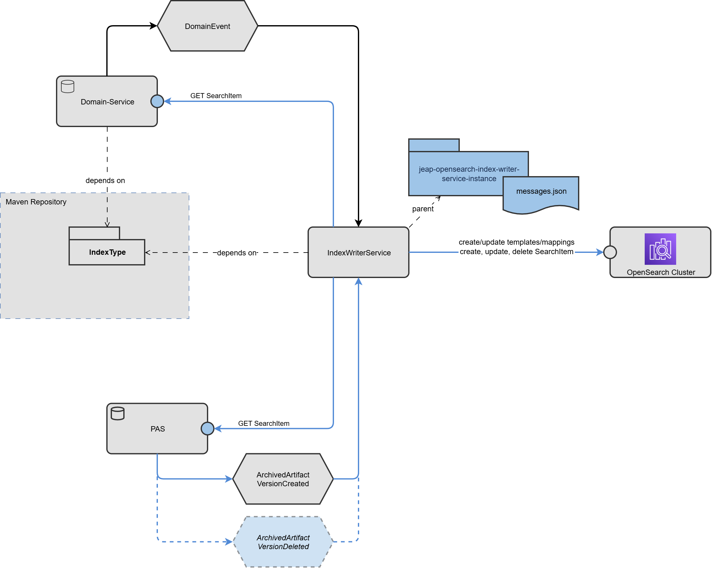

# jeap-opensearch-index-writer-service

Service template to provide event-driven indexing of search items into OpenSearch. A service instance can be created by depending on this template, then adding specific message and operation configuration.

## Key Features

- **Declarative Message Configuration:** Messages with operations map an event type and topic to an index type and index operation (`UPSERT` or `DELETE`)
- **Multiple Operations:** Any number of operations can be configured per service instance
- **Reference Provider:** Each operation references a provider that extracts one or more business object references (OriginType, Id, optional Version) from the incoming event; all returned references are processed independently
- **SearchItem Provider:** Each operation declares the host of the SearchItem Provider API from which the search item is fetched
- **Conditional Execution:** operations can reference a condition; the operation is only executed if the event satisfies it
- **Feature Flags:** operations can be guarded by a feature flag; the operation is skipped when the flag is inactive
- **Schema Validation:** Before writing, the service verifies that the SearchItem returned by the provider is compatible with the target IndexType definition
- **Managed Metadata:** Before writing, the service enriches each `SearchItem` with `search_item.upserted_at` (timestamp of the index write), `search_item.major_version` and `search_item.minor_version` (version of the `IndexType` mapping used at write time)
- **Index Alias Writes:** All writes use the `IndexWriteAlias` of the IndexTypeVersion, supporting platform-managed index rotation
- **Error Handling:** If an index operation fails, the triggering event is forwarded to the jEAP error handling service
- **Startup Mapping Validation:** On startup, the service compares the index mappings against the IndexType definitions — compatible deviations are updated automatically, incompatible deviations prevent startup

## Overview



## Naming Conventions

### Index Type Artifact Naming

| Concept         | Pattern                         | Regex              | Examples                         |
|-----------------|---------------------------------|--------------------|----------------------------------|
| System          | Name of a business application  | `[A-Z][a-z0-9]+`   | `JME`, `WVS`, `Prezius`          |
| Business Object | Type of the business object     | `[A-Z][a-z0-9]+`   | `DecreeDocument`, `Registration` |
| MajorVersion    | Breaking version                | Integer            | `1`, `2`                         |
| MinorVersion    | Compatible version              | Integer            | `0`, `1`                         |
| Interval        | Rollover sequence number        | 6-digit zero-padded integer | `000001`, `000002`               |

### OpenSearch Index

A physical OpenSearch index managed by rollover. One index per `IndexTypeVersion`, partitioned by rollover sequence (`-000001`, `-000002`, …). Rollover is handled server-side by the OpenSearch ISM (Index State Management) policy, which runs autonomously against the write alias. The write alias always points to the current write index.

**Pattern:** `<System>_<BusinessObject>_v<MajorVersion>-<Seq>` (snake_case, 6-digit zero-padded sequence)

**Examples:**
- `precious_registration_v1-000001`
- `www_declaration_v2-000001`
- `jme_decree_document_v1-000002`

### IndexWriteAlias

An alias pointing to the currently writable index for a specific major version.

**Pattern:** `<System>_<BusinessObject>_V<MajorVersion>_write`

**Examples:**
- `precious_registration_v1_write`
- `www_declaration_v2_write`
- `jme_decree_document_v1_write`

### IndexReadAlias

An alias pointing to all indices of an `IndexType` (all versions, all intervals). Used for search queries.

**Pattern:** `<System>_<BusinessObject>_read`

**Examples:**
- `precious_registration_read`
- `www_declaration_read`
- `jme_decree_document_read`

## Startup Behaviour

On startup, the `IndexMappingUpdater` component iterates over every registered `IndexTypeDescriptor` and calls `ensureIndexReady` for each one. This performs two operations against OpenSearch:

### 1. Index Template

The service **creates and manages the index template itself**. On every startup it unconditionally applies the template via PUT, creating it if it does not exist or overwriting it if it does. The template always contains the current mapping, configured settings, the read alias, and the ISM rollover alias setting.

The template name is derived from the write alias by stripping the `_write` suffix:

| Write alias                        | Template name                  | Index pattern              |
|------------------------------------|--------------------------------|----------------------------|
| `jme_decree_document_v1_write`     | `jme_decree_document_v1`       | `jme_decree_document_v1-*` |
| `precious_registration_v1_write`    | `precious_registration_v1`      | `precious_registration_v1-*`|

Settings are looked up under `jeap.opensearch.indexwriter.index-templates.<templateName>` (i.e. the template name without `_write`), falling back to the `default` entry. If neither is present, startup fails with a clear error.

> **Template settings vs existing partitions:** Changes to `number-of-shards`, `number-of-replicas`, and `refresh-interval` are written to the template on every startup but only take effect for new physical indices (partitions) created by ISM rollover — existing partitions are not affected. The mapping, by contrast, is applied to both the template and all existing physical indices immediately on startup.

> **Why the write alias is not in the template:** When ISM performs a rollover it creates the new partition from the template. If the template contained the write alias, the new partition would receive it immediately — while the old one still holds it — causing OpenSearch to reject the rollover with *"Rollover alias can point to multiple indices, found duplicated alias"*. The write alias is therefore set explicitly by the service only when it creates the initial physical index, and is then owned exclusively by ISM.

### 2. Index Mapping on existing physical indices

After updating the template, the service resolves the physical write index pointed to by the write alias and checks the `_meta.schema_version` stored in its mapping. The write index is identified by the `is_write_index: true` flag on the alias; if no index carries that flag (e.g. older setups with a single physical index), the single physical index is used.

- If the version **matches** the current minor version, the index is left untouched.
- If the version **differs**, the service pushes the updated mapping to that index via `PUT /{physicalIndex}/_mapping`.
- If the write alias **does not exist yet**, the service creates the initial physical index `{base}-000001` (e.g. `jme_decree_document_v1-000001`) with the write alias (`is_write_index: true`) set explicitly in the create request. The index template automatically applies settings (shards, replicas, ISM rollover alias) and the read alias to the new index.
- If OpenSearch returns a `cluster_block_exception` (e.g. the disk flood-stage watermark has been exceeded and the index has a `read-only-allow-delete` block), the service **logs a warning and continues** — startup is not aborted. The mapping update will be applied automatically on the next startup once the block is removed.

## Installing / Getting started

Normally you will not use this project directly, but instead set up your own index writer service instance by depending on this template, then adding specific message and operation configuration.

## Properties

| Property                                                                              | Default | Description                                                                                                                                                                                               |
|---------------------------------------------------------------------------------------|---------|-----------------------------------------------------------------------------------------------------------------------------------------------------------------------------------------------------------|
| `jeap.opensearch.indexwriter.connection.url`                                          | —       | URL of the OpenSearch cluster (e.g. `https://my-domain.eu-central-2.es.amazonaws.com`).                                                                                                                   |
| `jeap.opensearch.indexwriter.connection.signing-region`                               | —       | AWS region for SigV4 request signing (e.g. `eu-central-2`). When set, the default AWS credential provider chain is used (ECS task role, EC2 instance profile, etc.). Leave blank for non-AWS deployments. |
| `jeap.opensearch.indexwriter.index-templates.default.number-of-shards`               | —       | Fallback number of primary shards when no per-template entry is configured. Required if not all templates have a dedicated entry.                                                                         |
| `jeap.opensearch.indexwriter.index-templates.default.number-of-replicas`             | —       | Fallback number of replicas when no per-template entry is configured.                                                                                                                                     |
| `jeap.opensearch.indexwriter.index-templates.default.refresh-interval`               | —       | Fallback refresh interval when no per-template entry is configured.                                                                                                                                       |
| `jeap.opensearch.indexwriter.index-templates.<templateName>.number-of-shards`        | —       | Number of primary shards for this index template. Applied to the template on every startup; takes effect only when a new partition is created by ISM rollover.                                            |
| `jeap.opensearch.indexwriter.index-templates.<templateName>.number-of-replicas`      | —       | Number of replicas for this index template. Applied to the template on every startup; takes effect only when a new partition is created by ISM rollover.                                                  |
| `jeap.opensearch.indexwriter.index-templates.<templateName>.refresh-interval`        | —       | Refresh interval for this index template. Applied to the template on every startup; takes effect only when a new partition is created by ISM rollover.                                                    |
| `jeap.opensearch.indexwriter.search-item-provider.timeout`                            | 30s     | Connect timeout for the rest client accessing the provider apis.                                                                                                                                          |

### OpenSearch Connection

Configure the OpenSearch connection via the `jeap.opensearch.indexwriter.connection` prefix.

Example for AWS OpenSearch Service (with IAM/SigV4):

```yaml
jeap:
  opensearch:
    indexwriter:
      connection:
        url: https://my-domain.eu-central-2.es.amazonaws.com
        signing-region: eu-central-2
```

Example for a local/non-AWS OpenSearch instance:

```yaml
jeap:
  opensearch:
    indexwriter:
      connection:
        url: https://my-opensearch-host:9200
```

### Index Rollover

Index rollover is managed server-side by an **OpenSearch ISM (Index State Management) policy** configured in IaC. The service itself does not trigger rollover.

**IaC responsibility:** IaC attaches an ISM policy via `ism_template` matching the index pattern (e.g. `jme_decree_document_v1-*`) and configures rollover thresholds. The index template is now managed by the service (see [Index Template](#1-index-template)).

The writer service creates the initial physical index (`{base}-000001`) on first startup if the write alias does not exist yet. It explicitly sets the write alias (`is_write_index: true`) in the create request; the template automatically applies the read alias and ISM rollover alias setting.

Configure template settings. The key is the **template name** (write alias without `_write` suffix). Use the special key `default` as a fallback for any template not explicitly configured. If neither a specific entry nor `default` is present, startup fails with a clear error. Settings are applied to the template on every startup; they take effect for new partitions created by ISM rollover only — existing partitions are not affected.

```yaml
jeap:
  opensearch:
    indexwriter:
      index-templates:
        default:
          number-of-shards: 1
          number-of-replicas: 1
          refresh-interval: "1s"
        jme_decree_document_v1:
          number-of-shards: 2
          number-of-replicas: 1
          refresh-interval: "5s"
```

### OpenSearch Permissions

The service principal (IAM role or OpenSearch internal user) requires the following permissions:

**Cluster permissions:**

| Permission                         | Purpose                                                                          |
|------------------------------------|----------------------------------------------------------------------------------|
| `indices:admin/index_template/put` | Create or update index templates on startup                                      |
| `indices:admin/aliases/get`        | Required at cluster level for alias resolution (also needed as index permission) |
| `indices:data/write/bulk`          | Write documents via the bulk API                                                 |

**Index permissions** (pattern `*`):

| Permission                     | Purpose                                                                                  |
|--------------------------------|------------------------------------------------------------------------------------------|
| `indices:admin/create`         | Create new physical indices                                                              |
| `indices:admin/aliases`        | Manage index aliases                                                                     |
| `indices:admin/aliases/exists` | Check whether an alias exists                                                            |
| `indices:admin/aliases/get`    | Resolve which physical indices are behind a write alias                                  |
| `indices:admin/mappings/get`   | Read the current mapping of a physical index                                             |
| `indices:admin/mapping/put`    | Update the mapping of a physical index on startup                                        |
| `indices:data/write/bulk*`     | Write documents via the bulk API (wildcard form)                                         |
| `indices:data/write/bulk`      | Write documents via the bulk API                                                         |
| `indices:data/write/index`     | Index (upsert) individual documents                                                      |
| `indices:data/write/delete`    | Delete individual documents                                                              |
| `indices:data/read/get`        | Read individual documents                                                                |
| `indices:data/read/search`     | Execute search queries                                                                   |

As a JSON snippet for an OpenSearch security role:

```json
{
  "cluster_permissions": [
    "indices:admin/index_template/put",
    "indices:admin/aliases/get",
    "indices:data/write/bulk"
  ],
  "index_permissions": [
    {
      "index_patterns": ["*"],
      "allowed_actions": [
        "indices:admin/create",
        "indices:admin/aliases",
        "indices:admin/aliases/get",
        "indices:admin/mappings/get",
        "indices:admin/mapping/put",
        "indices:data/write/bulk*",
        "indices:data/write/bulk",
        "indices:data/write/index",
        "indices:data/write/delete",
        "indices:data/read/get",
        "indices:data/read/search"
      ]
    }
  ]
}
```

### Message Configuration

Message-to-operation mappings are loaded at startup from the location `/opensearch/messages.json`.

Each entry in the `messages` array maps a Kafka message type and topic to one or more index operations.

```json
{
  "messages": [
    {
      "messageName": "MyDocumentCreatedEvent",
      "topicName": "my-document-created",
      "operations": [
        {
          "indexType": "MyDocument",
          "indexOperation": "UPSERT",
          "uri": "${my.service.resource.base-uri}",
          "oauthClientId": "my-service-client-id",
          "referenceProvider": "com.example.indexwriter.MyDocumentReferenceProvider",
          "condition": "com.example.indexwriter.MyDocumentActiveCondition",
          "featureFlag": "MY_DOCUMENT_INDEXING"
        }
      ]
    },
    {
      "messageName": "MyDocumentDeletedEvent",
      "topicName": "my-document-deleted",
      "operations": [
        {
          "indexType": "MyDocument",
          "indexOperation": "DELETE",
          "uri": "${my.service.resource.base-uri}",
          "referenceProvider": "com.example.indexwriter.MyDocumentReferenceProvider"
        }
      ]
    }
  ]
}
```

**Message fields:**

| Field         | Required | Description                                                       |
|---------------|----------|-------------------------------------------------------------------|
| `messageName` | ✅        | Simple class name of the Avro-generated message type.             |
| `topicName`   | ✅        | Kafka topic the message is consumed from.                         |
| `operations`  | ✅        | One or more index operations to execute when the message arrives. |

**Operation fields:**

| Field               | Required | Description                                                                                                                                                                                                                                                          |
|---------------------|----------|----------------------------------------------------------------------------------------------------------------------------------------------------------------------------------------------------------------------------------------------------------------------|
| `indexType`         | ✅        | Name of the target IndexType (must match a registered `IndexTypeDescriptor`).                                                                                                                                                                                        |
| `indexOperation`    | ✅        | `UPSERT` or `DELETE` (case-insensitive).                                                                                                                                                                                                                             |
| `uri`               | ✅        | URI of the SearchItem Provider endpoint. Spring property placeholders (`${...}`) are resolved at startup.                                                                                                                                                            |
| `oauthClientId`     | ❌        | The OAuth Client ID used to call the SearchItem Provider. Register this OAuth2 client in spring.security.oauth2.client.registration. If not configured, no OAuth Client is used.                                                                                     |
| `referenceProvider` | ✅        | Fully qualified class name of the Spring bean implementing `ReferenceProvider<M>`. The `extractReference` method returns a `List<OriginReference>`; all returned references are processed independently. E.g. `com.example.indexwriter.MyDocumentReferenceProvider`. |
| `condition`         | ❌        | Fully qualified class name of the Spring bean implementing `IndexingCondition`. The operation is skipped when the condition evaluates to `false`.                                                                                                                    |
| `featureFlag`       | ❌        | Name of a jEAP feature flag. The operation is skipped when the flag is inactive.                                                                                                                                                                                     |

## Write Target

All document operations target the **`IndexWriteAlias`** of the configured `IndexTypeVersion` (e.g. `mydocument_v1_write`). Using an alias rather than a physical index name allows rollover to rotate physical indices transparently — when a rollover fires, the write alias is atomically re-pointed to the new `-<seq>` index.

| Operation | OpenSearch call                                                                 |
|-----------|---------------------------------------------------------------------------------|
| `UPSERT`  | `PUT /{indexWriteAlias}/{documentId}` — creates or fully replaces the document  |
| `DELETE`  | `DELETE /{indexWriteAlias}/{documentId}` — removes the document by its ID       |

The document ID is derived from each `OriginReference` returned by the configured `ReferenceProvider`. The provider returns a list — if multiple references are returned, the operation is executed independently for each one.

### Indexed Document Structure

Every document written to OpenSearch has the following top-level structure:

```json
{
  "search_item": {
    "upserted_at":   "<ISO-8601 timestamp of the index write>",
    "major_version": 1,
    "minor_version": 1
  },
  "origin": {
    "id":         "<business object ID>",
    "version":    "<business object version>",
    "bp_id":      "<business partner ID>",
    "tenant":     "<tenant identifier, optional>",
    "created":    "<ISO-8601 creation timestamp>",
    "modified":   "<ISO-8601 last-modified timestamp>",
    "reference":  { "<provider-specific reference data>" }
  },
  "data": {
    "<snake_case_field>": "<value>",
    "..."
  }
}
```

| Field              | Type      | Description                                                                      |
|--------------------|-----------|----------------------------------------------------------------------------------|
| `search_item`      | object    | Metadata added by the index writer service on every write                        |
| `upserted_at`      | date      | Timestamp of the index write operation                                           |
| `major_version`    | integer   | Major version of the `IndexType` mapping used at write time                      |
| `minor_version`    | integer   | Minor version of the `IndexType` mapping used at write time                      |
| `origin`           | object    | Reference back to the origin business object — populated by the resource service |
| `origin.id`        | keyword   | Unique ID of the business object                                                 |
| `origin.version`   | keyword   | Version string of the business object                                            |
| `origin.bp_id`     | keyword   | Business partner ID                                                              |
| `origin.tenant`    | keyword   | Tenant identifier (optional, may be `null`)                                      |
| `origin.created`   | date      | Creation timestamp of the business object                                        |
| `origin.modified`  | date      | Last-modified timestamp of the business object                                   |
| `origin.reference` | object    | Provider-specific reference data (not indexed, `enabled: false`)                 |
| `data`             | object    | Business data — defined by the `IndexType` mapping, always snake_case            |

### Snake_case serialisation

The service relies on the **typed data class generated by the `IndexType` registry Maven plugin** to ensure correct snake_case field names in OpenSearch. During an upsert, the raw `data` received from the SearchItem provider is deserialized into the `Class<T>` returned by `IndexType.dataClass()`. The generated data class carries explicit `@JsonProperty("snake_case_name")` annotations on every field, so the field names written to OpenSearch always match the mapping definition — regardless of how the provider serialised the data.

**All field names in the `data.properties` section of the mapping must be snake_case.** The registry Maven plugin enforces this at build time: any camelCase field name in a mapping file fails the build with a validation error.

#### SearchItem provider responsibility

The SearchItem provider (resource service) must serialise the `data` payload using the **same field names** declared in the `IndexType` data class — i.e. the snake_case names from the `@JsonProperty` annotations. The recommended approach is to use the generated data class directly as the response type, or to annotate the provider's own DTO with matching `@JsonProperty` annotations:

```java
// Option A — use the generated data class directly
public SearchItem<TransitDocumentData> getSearchItem(...) { ... }

// Option B — annotate the provider DTO to match the generated class
public class TransitDocumentDto {
    @JsonProperty("transit_document_id") String transitDocumentId;
    @JsonProperty("decided_by")          String decidedBy;
    ...
}
```

> ⚠️ **If the provider serialises field names that do not match the `@JsonProperty` names in the `IndexType` data class** (e.g. plain camelCase without annotations), Jackson will silently map all data fields to `null` in OpenSearch. No error is raised — the document is written with empty data. Always verify that the provider's serialised field names match the expected snake_case names.

Before an upsert, the service also validates that the `SearchItem` fields are compatible with the cached mapping (see [Startup Behaviour](#startup-behaviour)). Any field-level incompatibility is logged and causes the event to be forwarded to the jEAP error handling service.

## Consumer Contract Enforcement

The service enforces jEAP messaging consumer contracts at startup. Each Kafka message type configured in `messages.json` must have a matching consumer contract registered for the application.

Consumer contracts are generated at compile time by placing the `@JeapMessageConsumerContractsByTemplates` annotation on any class in the service instance module. The annotation reads the message configuration file and generates one consumer contract per configured message type.

```java
@JeapMessageConsumerContractsByTemplates(
    appName     = "my-opensearch-index-writer"
)
class MyOpenSearchIndexWriterApplication {
}
```

| Attribute         | Description                                                                                                                              |
|-------------------|------------------------------------------------------------------------------------------------------------------------------------------|
| `appName`         | Logical application name used for the consumer contracts. Defaults to `spring.application.name` from `application.y[a]ml` when not set.  |

The annotation is processed by `jeap-messaging-contract-annotation-processor` (pulled in transitively). If the annotation is absent, or the resolved `appName` does not match `spring.application.name`, the service will refuse to start with a `NoContractException`.

## SearchItems Provider Endpoint

Domain services that provide SearchItem data must expose a REST endpoint callable by the index writer service. This is provided by the **`jeap-opensearch-searchitem-api`** library — see [github.com/jeap-admin-ch/jeap-opensearch-searchitem-api](https://github.com/jeap-admin-ch/jeap-opensearch-searchitem-api) for setup and configuration details.

## SearchItemClient

The authorization-aware search client for consuming documents indexed by this service is provided by the **`jeap-opensearch-client-starter`** library — see [github.com/jeap-admin-ch/jeap-opensearch-client-starter](https://github.com/jeap-admin-ch/jeap-opensearch-client-starter) for setup and usage.

## Metrics

The service publishes the following Micrometer metrics:

| Metric                                  | Type  | Tags           | Description                                                                                                                                                           |
|-----------------------------------------|-------|----------------|-----------------------------------------------------------------------------------------------------------------------------------------------------------------------|
| `jeap.opensearch.indexwriter.indexing`  | Timer | `message_type` | Time spent processing a single indexing operation (includes skipped and failed ones). The `message_type` tag contains the name of the triggering Kafka message type.  |

## Changes

This library needs to be versioned using [Semantic Versioning](http://semver.org/) and all changes need to be documented at [CHANGELOG.md](./CHANGELOG.md) following the format defined in [Keep a Changelog](http://keepachangelog.com/).

## Index Type Registry Maven Plugin

The Maven plugin that validates the index type registry and generates typed Java artifacts is maintained in its own repository: [github.com/jeap-admin-ch/jeap-opensearch-index-type-registry-maven-plugin](https://github.com/jeap-admin-ch/jeap-opensearch-index-type-registry-maven-plugin).

## Note

This repository is part of the open source distribution of jEAP. See [github.com/jeap-admin-ch/jeap](https://github.com/jeap-admin-ch/jeap) for more information.

## License

This repository is Open Source Software licensed under the [Apache License 2.0](./LICENSE).
