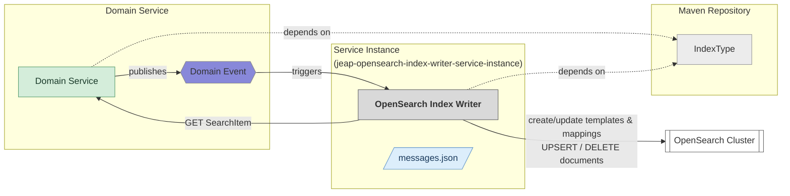
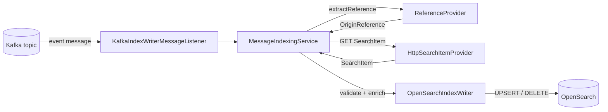
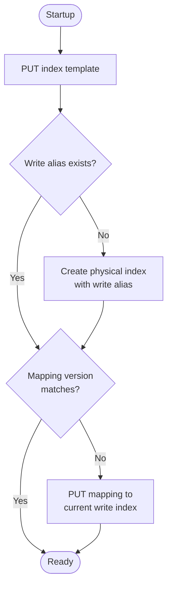

# Architecture

jEAP OpenSearch Index Writer is a Spring Boot service template for event-driven indexing of search
items into OpenSearch. A service instance is created by depending on the template and adding
index type and message configuration specific to the owning domain.

## Modules and responsibilities

The template follows hexagonal architecture: the domain module contains all business logic and
defines ports (interfaces); adapters implement those ports against concrete infrastructure.

| Module                    | Key types                                                                                      | Responsibility                                                     |
|---------------------------|------------------------------------------------------------------------------------------------|--------------------------------------------------------------------|
| `domain`                  | `MessageIndexingService`, `IndexWriter`, `ReferenceProvider`, `IndexingCondition`              | Core indexing logic; no framework dependency                       |
| `adapter-opensearch`      | `OpenSearchIndexWriter`, `IndexTemplateManager`, `PhysicalIndexManager`, `IndexMappingManager` | Creates/updates index templates and writes documents to OpenSearch |
| `adapter-kafka`           | `KafkaIndexWriterMessageListener`, `KafkaIndexWriterConsumerFactory`                           | Consumes Kafka events and forwards them to the domain              |
| `adapter-remote-data`     | `HttpSearchItemProvider`                                                                       | Fetches `SearchItem` data from the owning domain service via REST  |
| `index-config-repository` | `JsonMessageConfigurationRepository`                                                           | Loads and parses `/opensearch/messages.json` at startup            |
| `index-type-repository`   | `ServiceLoaderIndexTypeRepository`                                                             | Discovers registered `IndexType` Spring beans                      |
| `web`                     | `OpenSearchIndexWriterApplication`                                                             | Spring Boot wiring, auto-configuration                             |
| `service-instance`        | BOM                                                                                            | Thin dependency entry point for service instances                  |

## Event flow

An incoming Kafka event travels through the adapters to the domain and ends up as a document write
in OpenSearch:

Step by step:

1. **Consume.** `KafkaIndexWriterMessageListener` receives a message from the configured Kafka topic
   and forwards it to the `MessageIndexingService`.
2. **Extract references.** The `ReferenceProvider` bean configured for the operation extracts one or
   more `OriginReference` objects from the message. Each reference is processed independently.
3. **Fetch SearchItem.** For `UPSERT` operations, `HttpSearchItemProvider` calls the owning domain
   service's SearchItem Provider endpoint and retrieves the current search representation.
4. **Validate and enrich.** The service validates the `SearchItem` fields against the `IndexType`
   mapping and enriches the document with metadata (`upserted_at`, `major_version`, `minor_version`).
5. **Write.** `OpenSearchIndexWriter` sends the document to OpenSearch via the `IndexWriteAlias`
   using `UPSERT` (PUT) or `DELETE`.
6. **Error handling.** If any step fails, the triggering event is forwarded to the jEAP error
   handling service.

## Startup flow

On startup, `IndexMappingUpdater` iterates over every registered `IndexType` and calls
`ensureIndexReady`:

See [Startup behaviour](startup-behaviour.md) for details.

## Key design decisions

**Service-owned templates.** Index templates are created and managed by the index writer service at
startup, not by IaC. This keeps the template in sync with the `IndexType` mapping and removes the
need for separate IaC for each index.

**Write alias not in template.** The write alias is set explicitly only when the initial physical
index is created. Placing it in the template would cause OpenSearch to reject ISM rollovers with a
duplicate-alias error.

**Declarative message configuration.** All message-to-operation mappings are declared in a JSON
file rather than in code. This allows the same template code to power many different service
instances without any business logic changes.

**Hexagonal architecture.** The domain module carries no framework dependency. All Spring Boot,
Kafka, and OpenSearch specifics live in adapters, making the core logic independently testable.

## Related

- [Getting started](getting-started.md)
- [Startup behaviour](startup-behaviour.md)
- [Message configuration](message-configuration.md)
- [Index types](index-types.md)
- [Write operations](write-operations.md)
- [jeap-opensearch-index-writer-service](../README.md)
